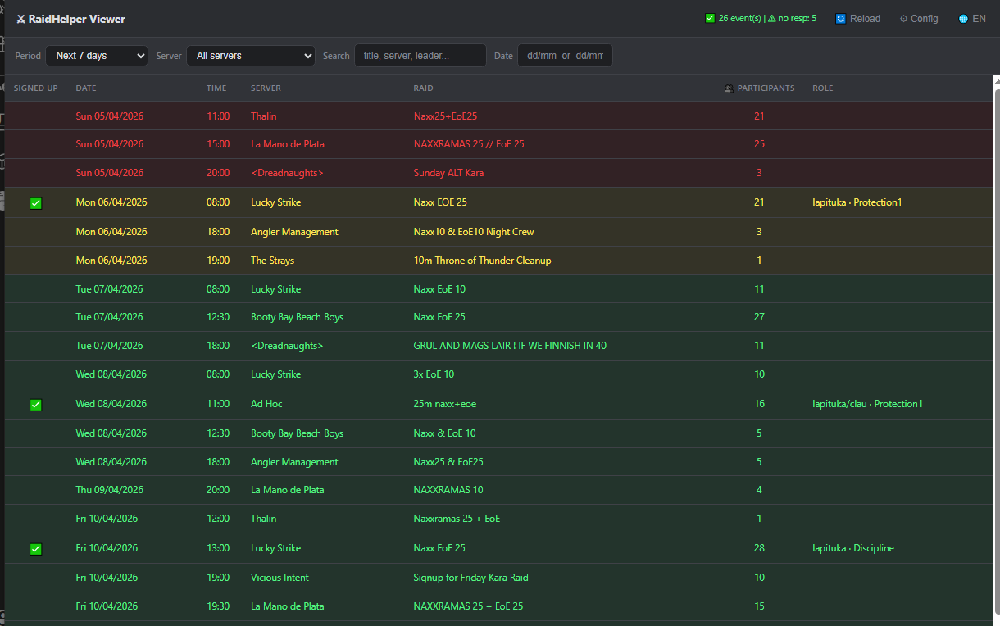
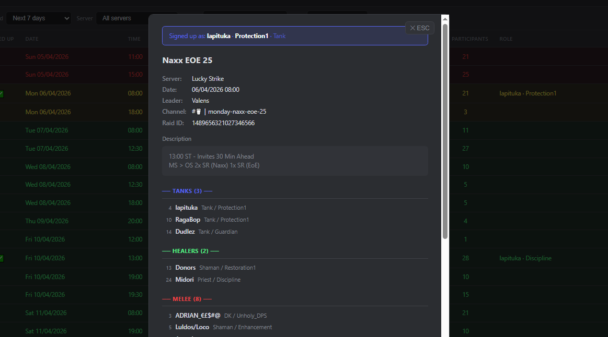
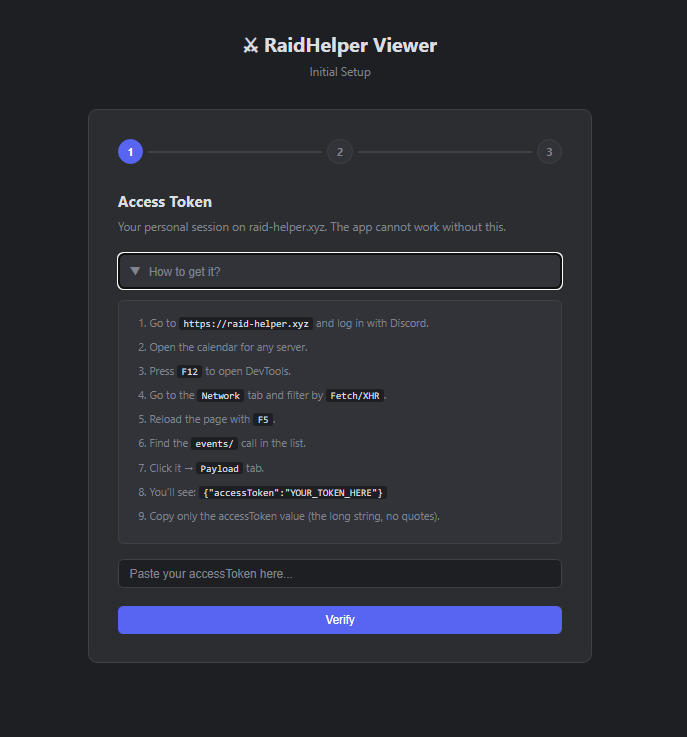
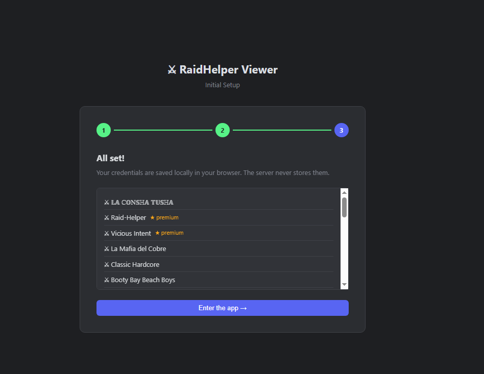

# English Version

> 🌐 [Versión en español](README.es.md)

# ⚔ Raid Helper Viewer — Web App

A web dashboard to visualize all your Raid Helper events across multiple
Discord servers from a single screen, directly in the browser.

> Built by [rebeatle](https://github.com/rebeatle) — because jumping between
> 14 Discord channels just to check the calendar is a raid by itself.

> 🖥️ Prefer the desktop version? → [RaidHelperCalendar](https://github.com/rebeatle/raidhelpercalendar)

---

## 🌐 Live Demo

**[Open the app](https://raid-helper-viewer.up.railway.app)**

---

## What is this?

If you use Raid Helper across multiple Discord servers, you know the pain of
having to check channel by channel to see what raids are scheduled.

RHV Web solves that: a single screen accessible from any browser,
with all your upcoming events, filters, color coding by date proximity,
and a mark showing which ones you're already signed up for.






---

## Features

- 📅 **Unified view** of events from multiple servers
- 🔴🟡🟢 **Color by proximity** — today, tomorrow, this week
- ✅ **Mark your events** — instantly see where you're already signed up
- 🔍 **Filters** by period, server, free text, and exact date
- 📋 **Full event details** with role signups (Tanks, Healers, Melee, Ranged)
- 🔄 **Auto-reload** every 5 minutes in the background
- 🔁 **Automatic retries** for servers that didn't respond on load
- 🌐 **Spanish / English** — switchable from within the app
- 🔒 **No database** — your credentials are never stored on the server

---

## Privacy & Security

Your credentials **never leave your browser** except in requests to the server,
and the server discards them immediately without storing them.

| What | Where it's stored |
|------|-------------------|
| Access Token | Only in your browser's `localStorage` |
| User API Key | Only in your browser's `localStorage` |
| On the server | Nothing — discarded after each request |

---

## How to use it

### 1. Access Token *(required)*

This is your personal session on raid-helper.xyz. To get it:

1. Go to [raid-helper.xyz](https://raid-helper.xyz) and log in with Discord
2. Open the calendar for any server
3. Press `F12` to open DevTools
4. Go to the **Network** tab and filter by **Fetch/XHR**
5. Reload the page with `F5`
6. Find the **`events/`** call → **Payload** tab
7. Copy the value of `accessToken` (the long string, no quotes)

> ⚠️ This token is personal — do not share it with anyone.
> It expires over time. If the app stops showing events, update it
> from the Settings menu.

### 2. User API Key *(optional)*

Allows marking with ✅ the events you're already signed up for.

In Discord, send the **Raid Helper** bot this command:
```
/usersettings apikey show
```

---

## Colors

| Color | Meaning |
|-------|---------|
| 🔴 Red | Event is today |
| 🟡 Yellow | Event is tomorrow |
| 🟢 Green | Event is this week |
| ⚪ White | Event is later |

---

## Tech Stack

| Layer | Technology |
|-------|------------|
| Backend | Python 3.11 + Flask |
| Frontend | Vanilla JS — no frameworks |
| Deploy | Railway + Gunicorn |
| Styles | Dark theme inspired by Discord |

---

## Run locally

```bash
git clone https://github.com/rebeatle/rhv-webapp
cd rhv-webapp
pip install -r requirements.txt
python server.py
```

Open `http://localhost:5000` in your browser and complete the initial setup.

---

## Self-host on Railway

1. Fork this repository
2. Create a new project on [Railway](https://railway.app) and connect your fork
3. Add the environment variable `FLASK_SECRET_KEY` with a secure random value
4. Railway detects the `Procfile` automatically — done

---

## FAQ

**Why isn't the app showing events?**
Most likely your Access Token has expired. Go to the Settings menu
and follow the steps to get a new one.

**Why don't I see ✅ on my events?**
You need to configure the User API Key from the Settings menu.

**Is it official? Does it have Raid Helper's permission?**
This is not an official Raid Helper product. It uses the same API as the
raid-helper.xyz frontend with your personal session. Each user authenticates
with their own credentials. If Raid Helper changes its API, it may stop
working until the project is updated.

**Are my credentials safe?**
Yes. The server never stores your credentials — it uses them to query
Raid Helper and immediately discards them. No database, no user logs.

---

## Technical Notes

RHV replicates the calls made by the raid-helper.xyz frontend using
the Discord OAuth session `accessToken`. There is no publicly documented API —
this was discovered by observing the network traffic of the official website.

---

## Roadmap

Features planned for future versions:

- 📤 **Export to ICS** — generate an `.ics` file from the selected event
  to import directly into Google Calendar, Outlook, or any calendar client.

- 🎯 **Filter by role** — see which events have open spots for a specific
  role (Tanks, Healers, Melee, Ranged), making it easier to decide where
  to sign up.

- 🔃 **Sortable columns** — sort the table by server, participant count,
  or other fields by clicking the column header.

- 📱 **Better mobile support** — optimize the table layout for small screens.

---

## Contributions

Pull requests are welcome. If something breaks due to changes in the
Raid Helper API, open an issue.

---

## License

This project is licensed under **GNU GPL v3**.

You are free to use, study, and modify the code, but any distributed modified version must:
- Also be open source under GPL v3
- Give credit to the original author
- **Not be sold or used commercially** without explicit permission from the author

© 2026 [rebeatle](https://github.com/rebeatle) — All rights reserved under GPL v3.

For commercial use or special agreements, contact the author directly.
